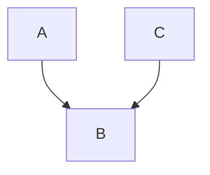
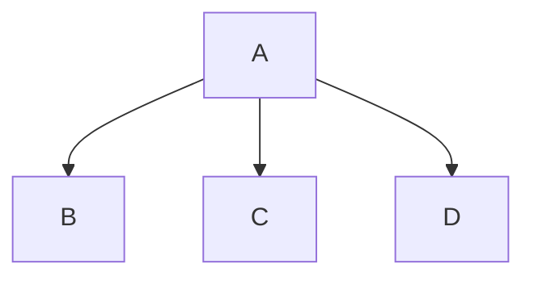
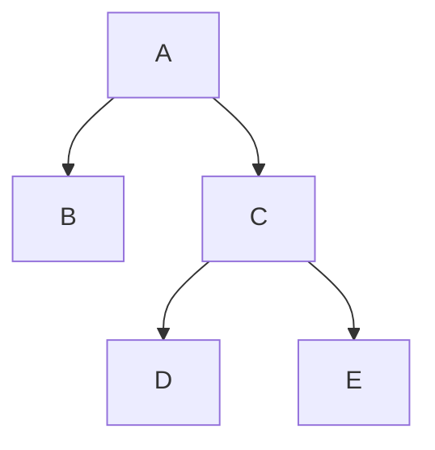

---
{"dg-publish":true,"permalink":"/02-academics/btech/s7/python-for-engineers/class-notes/"}
---


- [[#Module 1]]
- [[#Module 3]]
- [[#Module 4]]
- [[02 Academics/Btech/S7/Python For Engineers/Assignment1\|Assignment1]]
- [[02 Academics/Btech/S7/Python For Engineers/Series Exam 2\|Series Exam 2]]
- [[02 Academics/Btech/S7/Python For Engineers/main Exam\|main Exam]]

## Module 1

- [[#Syllabus]]

#### Syllabus

- [ ] Getting Started with Python Programming
- [ ] Running code in the interactive shell,
  - [ ] Editing,
  - [ ] Saving,
  - [ ] and Running a script.
- [ ] Using editors
  - [ ] IDLE,
  - [ ] Jupyter.
- [ ] Basic coding skills
- [ ] - [ ] Working with data types,
  - [ ] Numeric data types and Character sets,
  - [ ] Keywords,
  - [ ] Variables and
  - [ ] Assignment statement,
  - [ ] Operators,
  - [ ] Expressions,
  - [ ] Working with numeric data,
  - [ ] Type conversions,
  - [ ] Comments in the program,
  - [ ] Input Processing,
  - [ ] and Output,
  - [ ] Formatting output.
- [ ]
- [ ] How Python works.
- [ ] Detecting and correcting syntax errors.
- [ ] Using built in functions and modules in math module.
- [ ] Control statements
- [ ] Selection structure
  - [ ] if-else,
  - [ ] if-elif-else.
- [ ] Iteration structure
  - [ ] for, while.
- [ ] Testing the control statements.
- [ ] Lazy evaluation.

### 08.08.2024

#### Precedence

#examples

```python
name=input("Enter Your Name")
print(name)
print("Hi " + name);
```
{ #ca3a12}


[File](./Codes/name_1.py)

- It's type is default to **String** so to convert it into integer

```python
# Adition of 2 numbers by reading user input
def sum(x,y){
  return x+y
}
num_1= int(input("Enter a number"))
num_2=int(input("Enter the Second Number"))
print("Sum is = " + sum(num_1,num_2))
```

- Interpreted -> Line by line compilation or runtime compilation
- Intentation -> 4 spaces (Tab) should be ,
  - Space is used insted of `{},() etc.`

#### Control Statements

main -> Driver function in other languages
In python

```python
if __name__ == "__main__":
  <strting fn here>

```

###### IF ELSE

#syntax

```python
if condition:
  code
else
```

#smple_program

```python
# Find Largest among 2 numbers
def is_large(num_1,num_2):
    if (num_1 > num_2):
        return True
    else:
        return False
num_1 = int(input("Enter the first Number"))
num_2 = int(input("Enter the second Number"))
print("The Bigger Number is ", is_large(num_1,num_2) and num_1 or is_large(num_2,num_1) and num_2)
```

```python
# Even or off
```

#### Iterative Statements(Loops)

##### For loop

```python
for <variable> in range(<an integer expression>):
	code
```

#example

```python
for i in range(4):
	print(i)
```

#example

```python
# print from 1 to 10
for i in range(1,11):
    print(i)
```

##### while loops

#syntax

```python
while <condition>:
	<code>
```

#example

```python
i=1
while (i<11):
    print("2 times " , i , "= " , i*2)
    i+=1
```

> [!info] Print all even number less than 20
>
> ```python
> i = 1
> while(i<21):
> 	print(i)
> 	i+=2
> ```

#### 16-08-2024

- Armstron or Not

```python
# check whether armstron or not
# armstrong = sum of cubes of a given number is = the number itself
def armstrong(number):
    sum = 0
    while number != 0:
        a = number % 10
        sum = sum + (a**3)
        number = number // 10
    return sum


number = int(input("Enter a number"))
if number == armstrong(number):
    print("Number is armstrong")
else:
    print("Number is not armstrong")

```

- armstrong from 1 to 1000

```python
# print armstrong from 1 to 1000
# armstrong = sum of cubes of a given number is = the number itself
def armstrong(number):
    sum = 0
    while number != 0:
        a = number % 10
        sum = sum + (a**3)
        number = number // 10
    return sum


for i in range(1, 1000):
    if i == armstrong(i):
        print(i)
```

3. Find if prime

```python
# find out given number is prime or not
def prime_or_not(number):
    if number % 2 == 0:
        print("Number is not prime")
    else:
        for i in range(2, number // 2):
            status = 1
        if status == 1:
            print("Number is prime")


number = int(input("Enter a number"))
prime_or_not(number)
```

#### 26-08-2024

##### Functions

#syntax

```python
def function_name(parameters):
	.
	.
	.
	return
```

`def function_name(parameters):` function header
#example

```python
def sum(a,b):
	return a+b
def read_input():
	a=int(input("en num 1 "))
	b=int(input("en num 2 "))
	print 'sum is = ' , sum(a,b)

if __name__ == '__main__':
	read_input()
```

```python
def sum(a,b):
	return a+b
def read_input():
	a=int(input("en num 1 "))
	b=int(input("en num 2 "))
	print 'sum is = ' , sum(a,b)


def single_line_fn():
	a=int(input("en num 1 "))
	b=int(input("en num 2 "))
	sum = lambda x,y:x + y
	print 'sum is = ' , sum(a,b)
def largest_of_2(a,b):
	return a>b

if __name__ == '__main__':
	a = 5
	b =10
	print 'largest is ' ,( largest_of_2(a,b) and a )  or ( largest_of_2(b,a) and b )
```

##### Scope and Lifetime

Scope: The

- [ ] C
      Lifetime: The
- [ ] C

#### 2024-08-29

##### Recursive Functions

When a function call it self

```python
def function_name:
    function_name()

```

#### 2024-08-31

##### Strings

1. `.center()`

```python
s ='Hello'
print(s.center(30))

# print ** before and after
print(s.center(30, "*"))
```

2. Is alpha
   > Returns `True` is `all` letters are `Alphabets`

```python
# return true if it is alpha
print(s.isalpha())

# Output
# True
```

3. `.isdigit()`
   > Return `True` only if the string contains all digits

```python
# Return false
print(s.isdigit())

s = 5
print(str(s).isdigit())
```

3. `.count()`

```python
s = "Hi hi hi hi "
print(s.count("i"))
print(s.count("hi"))
# output
# 4
# 3
```

4. `.endswith()`

> Returns true if string ends with the provided character

```python
print(s.endswith("hi")) # Returns true if string ends with the provided character

```

5. `str.find()`
   > Returns the starting location of the given subsequence

```python
print(s.find("Hi"))
# output
# 0
```

6. `.join()`
   > Contatinates 2 strings

```python
a = "Hello "
b = "Sir"
c = [a, b]
print(" ".join(c))
print("*".join(c))
# output
# Hello Sir
# Hello *Sir
```

7. `.lower()`

```python
a = "HELLo"
print(a.lower())
# output
# hello
```

- [ ] In and Not in operator

#### 2024-09-03

##### Lists

```python

first = [1, 2, 3, 4]
  second = list(range(1, 5))
  print(first)
  print(" length is ", len(first))
  # print single

 for i in range(0, len(first)):
     print(first[i])

```

#### 2024-09-12

- [ ] Dictionary

##### Dictionary

#syntax

```python
a_dict = {"key" : "value" , "key1" : "value1" }
a_dict["key"]
a_dict["key2"]
```

#example

```python
a = { "name" : "Something" , "age" : "23"}
print(a['name'])
print(a["age"])
```

- Adding Keys and replacing keys
- We can use `[]` operator

```python
a_dict["some key"] = "new_value"
```

#example

```python
a = { "age" : "23","name" : "Something" }
print(a['name'])
print(a["age"])
a["college"] = "GCEK"
print(a)
```

- Replacing Values

```python
a["college"] = "GCEK"
print(a)
a["college"] = "CET"
print(a)
```

##### Set

- uses only elements seperated by ","
  #example

```python
fruits = {"fruit_1","fruit_2","fruit_3"}
```

```python
a = { "age" : "23","name" : "Something" }
print(a['name'])
print(a["age"])
a["college"] = "GCEK"
print(a)
a["college"] = "CET"
print(a)


# Prints None if the value is not exist
print(a.get("marks",None)) # .get is the replacement for has_key
print(a.get("marks",True))
print(a.get("marks",False))
print(a.get("name",False))
##### Alternative to get
try:
	print(a["marks"])
except:
	 print(None)

# .pop method is used to remove
a.pop("name")
print(a)
a.pop("name",None)

# len(a) return the length of entries
print(len(a))

############## SET ###########
fruits = {'apple','orenge'}

print("apple" in fruits)
print(fruits)
## pop in set
# It remove the last index item
fruits.pop()
print(fruits)
```

##### Dictionary

#syntax

```python
a_dict = {"key" : "value" , "key1" : "value1" }
a_dict["key"]
a_dict["key2"]
```

#example

```python
a = { "name" : "Something" , "age" : "23"}
print(a['name'])
print(a["age"])
```

- Adding Keys and replacing keys
- We can use `[]` operator

```python
a_dict["some key"] = "new_value"
```

#example

```python
a = { "age" : "23","name" : "Something" }
print(a['name'])
print(a["age"])
a["college"] = "GCEK"
print(a)
```

- Replacing Values

```python
a["college"] = "GCEK"
print(a)
a["college"] = "CET"
print(a)
```

##### Set

- uses only elements seperated by ","
  #example

```python
fruits = {"fruit_1","fruit_2","fruit_3"}
```

```python
a = { "age" : "23","name" : "Something" }
print(a['name'])
print(a["age"])
a["college"] = "GCEK"
print(a)
a["college"] = "CET"
print(a)
# Prints None if the value is not exist
print(a.get("marks",None)) # .get is the replacement for has_key
print(a.get("marks",True))
print(a.get("marks",False))
print(a.get("name",False))
##### Alternative to get
try:
	print(a["marks"])
except:
	 print(None)

# .pop method is used to remove
a.pop("name")
print(a)
a.pop("name",None)

# len(a) return the length of entries
print(len(a))

############## SET ###########
fruits = {'apple','orenge'}

print("apple" in fruits)
print(fruits)
## pop in set
# It remove the last index item
fruits.pop()
print(fruits)
```

### Module 3

#### 2024-09-27

Key: `Class` , `Objects` , `OOP` , `Polymorphism `

Polymorphism:

```python
class Person:
  def __init__(self,fname,lname):
    # __init__ is a constructor it runs automatically when a object is created.
    self.firstname = fname
    self.lastname = lname

  # Functions are __init__ and printname()
  # firstname and lastname are the variables inside the function
  def printname(self):
    print(self.firstname,self.lastname)

  def printlength(self):
      print(len(self.firstname), len(self.lastname))

  def get_age(self, age1, age2):
      self.age1 = age1
      self.age2 = age2

  def print_age(self):
      print(f"John Age is {self.age1} Doe age is {self.age2}")


# How to create Object
x = Person("John","Doe")
# Here x is the object and when the object is created the __init__ is execited
# self is the reference of x
x.printname()

x.get_age(22, 22)
x.print_age()
```
{ #798cac}


##### Child Class

```python
# class new_child_class(parent_class):
class Student(Person):
  pass
```

#### 2024-10-03

- `super().init` ->

```python
"""Create a Person Class and create child class named Student and add graduation year for Parent class and create a clid class ??? """


class Person:
    def __init__(self, fname, lname):
        self.firstname = fname
        self.lastname = lname

    def printname(self):
        print(self.firstname, self.lastname)


Nivin = Person("Nivin", "Ravichandran")
# Nivin.printname()


class Student(Person):
    def __init__(self, fname, lname, year):
        super().__init__(fname, lname)
        self.graduationyear = year

    def printname(self):
        print(self.firstname, self.lastname, self.graduationyear)


Nivin_New = Student("Nivin", "Ravichandran", 2022)

# Nivin_New.printname()

print(Nivin_New.lastname)


class New_Gen_Z(Student):
    def __init__(self, fname, lname, year, age):
        super().__init__(fname, lname, year)
        self.age = age

    def printname(self):
        print(self.firstname, self.lastname, self.graduationyear, self.age)


Manual_New = New_Gen_Z("Manu", "Old", 2022, 22)

Manual_New.printname()
```

##### Types of Inheritance

- Mainly 4 types of Inheritance

1. Single Inheritance



2. Multiple Inheritance



3. Hybrid Inheritance



##### Questions

```python
"""Create a class Student with atributes name and roll no. and a method dataprint() for displauing the same. Create two instance of the class and call the method for each instance of the class"""


class Student:
    def __init__(self, name, rollno):
        self.name = name
        self.roll_number = rollno

    def dataprint(self):
        print(f"Name  : {self.name} Roll No : {self.roll_number}")


n = Student("neh", 35)
meg = Student("meg", 32)

n.dataprint()
meg.dataprint()
```

#### 2024-10-05

#### PolyMorphism

- Function Overloading: Same name but performs different operations

```python

```

- Operator Overloading: Same operator does diffrent things

```python
int(a) + int(b) = int
```

#### Abstract Class

_if a class contains abstract method then it is called as abstract class_

#### Concrete Class

_If there is no abstract method then it is called as concrete class_

#### Exception

- [[#Type error Exception]]
- [[#Name error Exception]]
- [[#Exception Handling]]

##### Type error Exception

_Type error occurs when the type of the variable is not correct_

##### Name error Exception

_Name error occurs when the variable is not defined_

##### Exception Handling

#example

```python
try:
    <Statement>
except <exception type>:
    <Statement>
```

#anotherExample

```python
try:
    something

except Exception as e:
    print(f"Error {e}")
```

###### Multiple Exception Handling

```python
except (TypeError,ValueError,RuntimError) :
```

Q: Calculate integer error?

#### 2024-10-08

#### Matplotlib and numpy

[[03 Coding/Python/matplotlib\|matplotlib]]

```python
import numpy as np
import matplotlib.pyplot as plt

plt.plot([1,2,3,2,3,4,3,4,5,1])
plt.show()

```

```python
import matplotlib.pyplot as plt
import numpy as np

# plt.plot -> marker reference , line reference , color reference


def plot():
    plt.plot([1, 2, 3, 2, 3, 4, 3, 4, 5, 1])  # it will consider it as y
    plt.show()


def plot_x_n_y():
    xpoints = np.array([0, 6])
    ypoints = np.array([0, 250])
    plt.plot(xpoints, ypoints)

    plt.show()


def plot_without_line():
    xpoints = np.array([0, 6])
    ypoints = np.array([0, 250])
    plt.plot(xpoints, ypoints, ".")
    plt.show()


def multple_plots():
    xpoints = np.array([1, 8])
    ypoints = np.array([3, 10])
    plt.plot(xpoints, ypoints)
    xpoints = np.array([1, 2, 6, 8])
    ypoints = np.array([3, 8, 1, 10])
    plt.plot(xpoints, ypoints)
    plt.show()


# Mark Points with circle
def mark_with_circle():
    ypoints = np.array([3, 8, 1, 10])
    plt.plot(ypoints, marker="*")
    plt.show()


def color_change():
    ypoints = np.array([3, 8, 1, 10])
    plt.plot(ypoints, "o-.r")  # dot , red color ,circle
    ypoints = np.array([2, 9, 2, 9])
    # plt.plot(ypoints, marker="o")
    plt.show()


def with_marker_size():
    ypoints = np.array([3, 8, 1, 10])
    plt.plot(ypoints, "o-.r", ms=20)  # ms -> marker size
    plt.show()


def with_marker_edge_color():
    ypoints = np.array([3, 8, 1, 10])
    plt.plot(
        ypoints, "o-.r", ms=20, mec="r", mfc="g"
    )  # ms -> marker size , mfc ? and mec ?
    plt.show()

```

### 2024-10-18

## References

- [ ] Need to complete 15-10-2024's note

1. [[03 Coding/Python/python\|python]]
