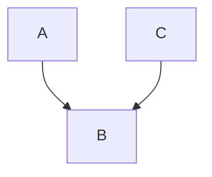
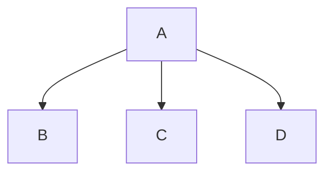
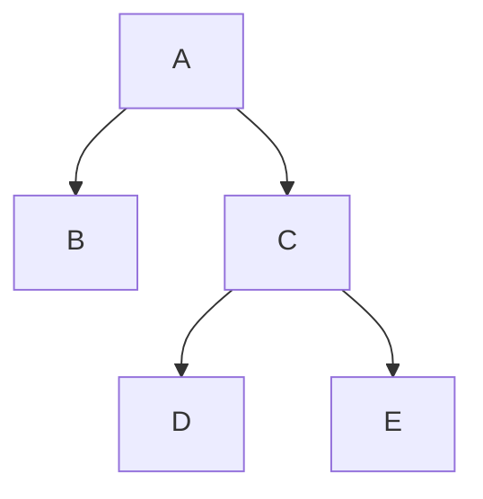

---
{"dg-publish":true,"permalink":"/03-coding/python/python-note-for-students/"}
---

# Python Note For Students
 *Note #for_students* 
 **Derived From** 
 - [[02 Academics/Btech/S7/Python For Engineers/Class Notes\|Class Notes]]
 - [[02 Academics/Btech/S7/Python For Engineers/CST445 Module 1\|CST445 Module 1]]
 - [[03 Coding/Python/python\|python]]

**Should Contain**
-  [ ] Simple intro
-  Basics
	- [x] Variables , Datatypes, Comment ✅ 2025-05-30
	- [x] Loops ✅ 2025-05-30
	- [x] Control Statements ✅ 2025-05-30
	- [x] Functions ✅ 2025-05-30
	- [ ] Scope 
	- [x] Strings ✅ 2025-05-30
	- [x] Lists ✅ 2025-05-30
	- [x] Dictionaries ✅ 2025-05-30
	- [x] Set ✅ 2025-05-30
- OOP 
	- [x] Inheritance ✅ 2025-05-30
	- [x] Polymorphism ✅ 2025-05-30
	- [x] Abstraction ✅ 2025-05-30
	- En..

## First Program

```python
print("Hello World!")
```{ #504014}


**What do you need?** 
- You will need the python interpreter installed and it's path should be in the `PATH` env variable 
	- Go [Here](https://www.python.org/) and install the python 
- there must be an option in the installer wizard for adding the python binary path to environment variables 

**How to run it**?
- Open a text editor 
- type the first program ![[#^504014]] and save with `.py` extension
- run it using python
```bash
python first_program.py
```

>[!Note] 
>The weird thing with python is that it is a scipting language yet most of the python programs are not scripts. And it is not like older programming languages it requres only very few lines eg:
>```python
>"Hello World!"
>``` 
>This will also print `Hello World!` to the terminal


## Basics

### Input/Output

<div class="transclusion internal-embed is-loaded"><div class="markdown-embed">


#### Input , output , processing


```python
# input
a = input("Enter a number")

# output
print(a)
```

- One thing to note here that the default type will be a string from the `input()` and you may need to type cast it to work as expected for example 
```python
a = input("Enter a number")
if a==5:
	print("HI")
```
- this program will not work as expected (run and find out) (happens because `int(5)` is not same as `str(5)`)
```python
a = int(input("Enter a number"))
if a==5:
	print("HI")
```


</div></div>


### Datatype

<div class="transclusion internal-embed is-loaded"><div class="markdown-embed">


#### Data types

| Integer          | `int`, `long` | 1,2,3, -1 , 0       |
| ---------------- | ------------- | ------------------- |
| Real Numbers     | `float`       | 1.2 , -1.2          |
| Character strngs | str           | "HI" , "" , "Hello" |


</div></div>


### Operators

<div class="transclusion internal-embed is-loaded"><div class="markdown-embed">


### Operators
1. Arithmetic

#### Arithmetic Operators
```python
a , b  = 1 , 2 
a + b  # 3 "#" is the single line comment
a - b  # -1  
a * b  # 2 
a / b  # .5 
a % b  #  1 
b ** 2 # 4
a // b # 0
```

#### Comparison Operator

```python
a, b = 5, 10

# Equal to
a == b  # False

# Not equal to
a != b  # True

# Greater than
a > b   # False

# Less than
a < b   # True

# Greater than or equal to
a >= b  # False

# Less than or equal to
a <= b  # True
```
#### Logical Operators

```python
x, y = True, False

# AND - True if both operands are True
x and y  # False

# OR - True if at least one operand is True
x or y   # True

# NOT - Inverts the Boolean value 0 -> 1 , 1 -> 0
not x    # False
not y    # True
```

#### Membership Operators
```python
lst = [1, 2, 3, 4]
name = "Arun"

# IN - True if value is found in sequence
2 in lst       # True
"run" in name  # True
5 in lst       # False

# NOT IN - True if value is not found in sequence
5 not in lst   # True
"y" not in name # True
```

#### Identity Operators
```python
m = [1, 2]
n = [1, 2]
p = m

# IS - True if both variables point to same object
m is p    # True

m is n    # False (same values but different objects)

# IS NOT - True if variables point to different objects
m is not n  # True
```

```python
print(m is n) # False , different objects even if values are sae
print(m == n) # True same value even if different objects
``` 

#### Bitwise Operators

```python 
a , b = 1, 2  # 01 , 10

''' Bitwise AND 
  01
& 10 '''
a & b  # 0

#Bitwise OR
# 11 
a | b  # 3

# Bitwise XOR
 
a ^ b  # 3

# Bitwise NOT
# this might be confusing explain later.
~a     # -2

#  Left Shift (<<)

a << 1  # 2

#Right Shift (>>)
a >> 1  # 0
```

- [ ] explain biwise `not` 🏁 delete 

#### Assignment Operators
```python
x = 10

x += 3  # x = x + 3 → 13
x -= 2  # 11
x *= 2  #  22
x /= 4  # 5.5
x %= 3  #  2.5
x **= 2 #   6.25
x //= 2 #  3.0
```


</div></div>


### Functions

<div class="transclusion internal-embed is-loaded"><div class="markdown-embed">


## Functions 
**Important things to keep in mind**
- intend the defenition of a function from its decleration
- scope is limited within intendations 

#syntax 


<div class="transclusion internal-embed is-loaded"><a class="markdown-embed-link" href="/02-academics/btech/s7/python-for-engineers/class-notes/#8ae1a2" aria-label="Open link"><svg xmlns="http://www.w3.org/2000/svg" width="24" height="24" viewBox="0 0 24 24" fill="none" stroke="currentColor" stroke-width="2" stroke-linecap="round" stroke-linejoin="round" class="svg-icon lucide-link"><path d="M10 13a5 5 0 0 0 7.54.54l3-3a5 5 0 0 0-7.07-7.07l-1.72 1.71"></path><path d="M14 11a5 5 0 0 0-7.54-.54l-3 3a5 5 0 0 0 7.07 7.07l1.71-1.71"></path></svg></a><div class="markdown-embed">

<div class="markdown-embed-title">

# Class Notes

</div>


```python
def function_name(parameters):
	.
	.
	.
	return
```

</div></div>


#example 


<div class="transclusion internal-embed is-loaded"><a class="markdown-embed-link" href="/02-academics/btech/s7/python-for-engineers/class-notes/#06cc71" aria-label="Open link"><svg xmlns="http://www.w3.org/2000/svg" width="24" height="24" viewBox="0 0 24 24" fill="none" stroke="currentColor" stroke-width="2" stroke-linecap="round" stroke-linejoin="round" class="svg-icon lucide-link"><path d="M10 13a5 5 0 0 0 7.54.54l3-3a5 5 0 0 0-7.07-7.07l-1.72 1.71"></path><path d="M14 11a5 5 0 0 0-7.54-.54l-3 3a5 5 0 0 0 7.07 7.07l1.71-1.71"></path></svg></a><div class="markdown-embed">

<div class="markdown-embed-title">

# Class Notes

</div>


```python
def sum(a, b):
    return a + b
def differece(a, b):
    return a - b
def division(a, b):
    return a / b
def multiplication(a, b):
    return a * b
print("Sum = ", sum(10, 20))
print("Difference  = ", differece(10, 20))
print("Division = ", division(10, 20))
print("Multiplication = ", multiplication(10, 20))
```

</div></div>


</div></div>


**Example 2**

<div class="transclusion internal-embed is-loaded"><a class="markdown-embed-link" href="/02-academics/btech/s7/python-for-engineers/class-notes/#3cd684" aria-label="Open link"><svg xmlns="http://www.w3.org/2000/svg" width="24" height="24" viewBox="0 0 24 24" fill="none" stroke="currentColor" stroke-width="2" stroke-linecap="round" stroke-linejoin="round" class="svg-icon lucide-link"><path d="M10 13a5 5 0 0 0 7.54.54l3-3a5 5 0 0 0-7.07-7.07l-1.72 1.71"></path><path d="M14 11a5 5 0 0 0-7.54-.54l-3 3a5 5 0 0 0 7.07 7.07l1.71-1.71"></path></svg></a><div class="markdown-embed">

<div class="markdown-embed-title">

# Class Notes

</div>


```python
# find out given number is prime or not
staus = 0
def prime_or_not(number):
    if number % 2 == 0:
        print("Number is not prime")
    else:
        for i in range(2, number // 2):
            status = 1
        if status == 1:
            print("Number is prime")


number = int(input("Enter a number"))
prime_or_not(number)
```

</div></div>


### Iterative Statements

<div class="transclusion internal-embed is-loaded"><div class="markdown-embed">


## Control Statements
1. Selection Strucure `if else`
2. Iteration structure `for i in ..`


<div class="transclusion internal-embed is-loaded"><a class="markdown-embed-link" href="/02-academics/btech/s7/python-for-engineers/class-notes/#if-else" aria-label="Open link"><svg xmlns="http://www.w3.org/2000/svg" width="24" height="24" viewBox="0 0 24 24" fill="none" stroke="currentColor" stroke-width="2" stroke-linecap="round" stroke-linejoin="round" class="svg-icon lucide-link"><path d="M10 13a5 5 0 0 0 7.54.54l3-3a5 5 0 0 0-7.07-7.07l-1.72 1.71"></path><path d="M14 11a5 5 0 0 0-7.54-.54l-3 3a5 5 0 0 0 7.07 7.07l1.71-1.71"></path></svg></a><div class="markdown-embed">

<div class="markdown-embed-title">

# Class Notes

</div>


###### IF ELSE

#syntax

```python
if condition:
  code
else
```

#smple_program

```python
# Find Largest among 2 numbers
def is_large(num_1,num_2):
    if (num_1 > num_2):
        return True
    else:
        return False
num_1 = int(input("Enter the first Number"))
num_2 = int(input("Enter the second Number"))
print("The Bigger Number is ", is_large(num_1,num_2) and num_1 or is_large(num_2,num_1) and num_2)
```

```python
# Even or off
```


</div></div>


<div class="transclusion internal-embed is-loaded"><a class="markdown-embed-link" href="/02-academics/btech/s7/python-for-engineers/class-notes/#iterative-statements-loops" aria-label="Open link"><svg xmlns="http://www.w3.org/2000/svg" width="24" height="24" viewBox="0 0 24 24" fill="none" stroke="currentColor" stroke-width="2" stroke-linecap="round" stroke-linejoin="round" class="svg-icon lucide-link"><path d="M10 13a5 5 0 0 0 7.54.54l3-3a5 5 0 0 0-7.07-7.07l-1.72 1.71"></path><path d="M14 11a5 5 0 0 0-7.54-.54l-3 3a5 5 0 0 0 7.07 7.07l1.71-1.71"></path></svg></a><div class="markdown-embed">

<div class="markdown-embed-title">

# Class Notes

</div>


#### Iterative Statements(Loops)

##### For loop

```python
for <variable> in range(<an integer expression>):
	code
```

#example

```python
for i in range(4):
	print(i)
```

#example

```python
# print from 1 to 10
for i in range(1,11):
    print(i)
```

##### while loops

#syntax

```python
while <condition>:
	<code>
```

#example

```python
i=1
while (i<11):
    print("2 times " , i , "= " , i*2)
    i+=1
```

> [!info] Print all odd number less than 20
>
> ```python
> i = 1
> while(i<21):
> 	print(i)
> 	i+=2
> ```


</div></div>


</div></div>


#applications 

<div class="transclusion internal-embed is-loaded"><a class="markdown-embed-link" href="/02-academics/btech/s7/python-for-engineers/class-notes/#16-08-2024" aria-label="Open link"><svg xmlns="http://www.w3.org/2000/svg" width="24" height="24" viewBox="0 0 24 24" fill="none" stroke="currentColor" stroke-width="2" stroke-linecap="round" stroke-linejoin="round" class="svg-icon lucide-link"><path d="M10 13a5 5 0 0 0 7.54.54l3-3a5 5 0 0 0-7.07-7.07l-1.72 1.71"></path><path d="M14 11a5 5 0 0 0-7.54-.54l-3 3a5 5 0 0 0 7.07 7.07l1.71-1.71"></path></svg></a><div class="markdown-embed">

<div class="markdown-embed-title">

# Class Notes

</div>


#### 16-08-2024

- Armstron or Not

```python
# check whether armstron or not
# armstrong = sum of cubes of a given number is = the number itself
def armstrong(number):
    sum = 0
    while number != 0:
        a = number % 10
        sum = sum + (a**3)
        number = number // 10
    return sum


number = int(input("Enter a number"))
if number == armstrong(number):
    print("Number is armstrong")
else:
    print("Number is not armstrong")

```

- armstrong from 1 to 1000

```python
# print armstrong from 1 to 1000
# armstrong = sum of cubes of a given number is = the number itself
def armstrong(number):
    sum = 0
    while number != 0:
        a = number % 10
        sum = sum + (a**3)
        number = number // 10
    return sum


for i in range(1, 1000):
    if i == armstrong(i):
        print(i)
```

3. Find if prime

```python
# find out given number is prime or not
staus = 0
def prime_or_not(number):
    if number % 2 == 0:
        print("Number is not prime")
    else:
        for i in range(2, number // 2):
            status = 1
        if status == 1:
            print("Number is prime")


number = int(input("Enter a number"))
prime_or_not(number)
```


</div></div>


### Strings


<div class="transclusion internal-embed is-loaded"><a class="markdown-embed-link" href="/02-academics/btech/s7/python-for-engineers/class-notes/#strings" aria-label="Open link"><svg xmlns="http://www.w3.org/2000/svg" width="24" height="24" viewBox="0 0 24 24" fill="none" stroke="currentColor" stroke-width="2" stroke-linecap="round" stroke-linejoin="round" class="svg-icon lucide-link"><path d="M10 13a5 5 0 0 0 7.54.54l3-3a5 5 0 0 0-7.07-7.07l-1.72 1.71"></path><path d="M14 11a5 5 0 0 0-7.54-.54l-3 3a5 5 0 0 0 7.07 7.07l1.71-1.71"></path></svg></a><div class="markdown-embed">

<div class="markdown-embed-title">

# Class Notes

</div>


##### Strings

1. `.center()`

```python
s ='Hello'
print(s.center(30))

# print ** before and after
print(s.center(30, "*"))
```

2. Is alpha
   > Returns `True` is `all` letters are `Alphabets`

```python
# return true if it is alpha
print(s.isalpha())

# Output
# True
```

3. `.isdigit()`
   > Return `True` only if the string contains all digits

```python
# Return false
print(s.isdigit())

s = 5
print(str(s).isdigit())
```

3. `.count()`

```python
s = "Hi hi hi hi "
print(s.count("i"))
print(s.count("hi"))
# output
# 4
# 3
```

4. `.endswith()`

> Returns true if string ends with the provided character

```python
print(s.endswith("hi")) # Returns true if string ends with the provided character

```

5. `str.find()`
   > Returns the starting location of the given subsequence

```python
print(s.find("Hi"))
# output
# 0
```

6. `.join()`
   > Contatinates 2 strings

```python
a = "Hello "
b = "Sir"
c = [a, b]
print(" ".join(c))
print("*".join(c))
# output
# Hello Sir
# Hello *Sir
```

7. `.lower()`

```python
a = "HELLo"
print(a.lower())
# output
# hello
```

- [ ] In and Not in operator


</div></div>


### Lists


<div class="transclusion internal-embed is-loaded"><a class="markdown-embed-link" href="/02-academics/btech/s7/python-for-engineers/class-notes/#2024-09-03" aria-label="Open link"><svg xmlns="http://www.w3.org/2000/svg" width="24" height="24" viewBox="0 0 24 24" fill="none" stroke="currentColor" stroke-width="2" stroke-linecap="round" stroke-linejoin="round" class="svg-icon lucide-link"><path d="M10 13a5 5 0 0 0 7.54.54l3-3a5 5 0 0 0-7.07-7.07l-1.72 1.71"></path><path d="M14 11a5 5 0 0 0-7.54-.54l-3 3a5 5 0 0 0 7.07 7.07l1.71-1.71"></path></svg></a><div class="markdown-embed">

<div class="markdown-embed-title">

# Class Notes

</div>


#### 2024-09-03

##### Lists

```python

first = [1, 2, 3, 4]
  second = list(range(1, 5))
  print(first)
  print(" length is ", len(first))
  # print single

 for i in range(0, len(first)):
     print(first[i])

```


</div></div>

### Dictionary


<div class="transclusion internal-embed is-loaded"><a class="markdown-embed-link" href="/02-academics/btech/s7/python-for-engineers/class-notes/#2024-09-12" aria-label="Open link"><svg xmlns="http://www.w3.org/2000/svg" width="24" height="24" viewBox="0 0 24 24" fill="none" stroke="currentColor" stroke-width="2" stroke-linecap="round" stroke-linejoin="round" class="svg-icon lucide-link"><path d="M10 13a5 5 0 0 0 7.54.54l3-3a5 5 0 0 0-7.07-7.07l-1.72 1.71"></path><path d="M14 11a5 5 0 0 0-7.54-.54l-3 3a5 5 0 0 0 7.07 7.07l1.71-1.71"></path></svg></a><div class="markdown-embed">

<div class="markdown-embed-title">

# Class Notes

</div>


#### 2024-09-12

##### Dictionary

#syntax

```python
a_dict = {"key" : "value" , "key1" : "value1" }
a_dict["key"]
a_dict["key2"]
```

#example

```python
a = { "name" : "Something" , "age" : "23"}
print(a['name'])
print(a["age"])
```

- Adding Keys and replacing keys
- We can use `[]` operator

```python
a_dict["some key"] = "new_value"
```

#example

```python
a = { "age" : "23","name" : "Something" }
print(a['name'])
print(a["age"])
a["college"] = "GCEK"
print(a)
```

- Replacing Values

```python
a["college"] = "GCEK"
print(a)
a["college"] = "CET"
print(a)
```

##### Set

- uses only elements seperated by ","
  #example

```python
fruits = {"fruit_1","fruit_2","fruit_3"}
```

```python
a = { "age" : "23","name" : "Something" }
print(a['name'])
print(a["age"])
a["college"] = "GCEK"
print(a)
a["college"] = "CET"
print(a)
# Prints None if the value is not exist
print(a.get("marks",None)) # .get is the replacement for has_key
print(a.get("marks",True))
print(a.get("marks",False))
print(a.get("name",False))
##### Alternative to get
try:
	print(a["marks"])
except:
	 print(None)

# .pop method is used to remove
a.pop("name")
print(a)
a.pop("name",None)

# len(a) return the length of entries
print(len(a))

############## SET ###########
fruits = {'apple','orenge'}

print("apple" in fruits)
print(fruits)
## pop in set
# It remove the last index item
fruits.pop()
print(fruits)
```


</div></div>


## Object Oriented Programming

<div class="transclusion internal-embed is-loaded"><a class="markdown-embed-link" href="/02-academics/btech/s7/python-for-engineers/class-notes/#2024-09-27" aria-label="Open link"><svg xmlns="http://www.w3.org/2000/svg" width="24" height="24" viewBox="0 0 24 24" fill="none" stroke="currentColor" stroke-width="2" stroke-linecap="round" stroke-linejoin="round" class="svg-icon lucide-link"><path d="M10 13a5 5 0 0 0 7.54.54l3-3a5 5 0 0 0-7.07-7.07l-1.72 1.71"></path><path d="M14 11a5 5 0 0 0-7.54-.54l-3 3a5 5 0 0 0 7.07 7.07l1.71-1.71"></path></svg></a><div class="markdown-embed">

<div class="markdown-embed-title">

# Class Notes

</div>


#### 2024-09-27

Key: `Class` , `Objects` , `OOP` , `Polymorphism `


```python
class Person:
  def __init__(self,fname,lname):
    # __init__ is a constructor it runs automatically when a object is created.
    self.firstname = fname
    self.lastname = lname

  # Functions are __init__ and printname()
  # firstname and lastname are the variables inside the function
  def printname(self):
    print(self.firstname,self.lastname)

  def printlength(self):
      print(len(self.firstname), len(self.lastname))

  def get_age(self, age1, age2):
      self.age1 = age1
      self.age2 = age2

  def print_age(self):
      print(f"John Age is {self.age1} Doe age is {self.age2}")


# How to create Object
x = Person("John","Doe")
# Here x is the object and when the object is created the __init__ is execited
# self is the reference of x
x.printname()

x.get_age(22, 22)
x.print_age()
```


</div></div>


### Child Class and Inheritance

<div class="transclusion internal-embed is-loaded"><a class="markdown-embed-link" href="/02-academics/btech/s7/python-for-engineers/class-notes/#2024-10-03" aria-label="Open link"><svg xmlns="http://www.w3.org/2000/svg" width="24" height="24" viewBox="0 0 24 24" fill="none" stroke="currentColor" stroke-width="2" stroke-linecap="round" stroke-linejoin="round" class="svg-icon lucide-link"><path d="M10 13a5 5 0 0 0 7.54.54l3-3a5 5 0 0 0-7.07-7.07l-1.72 1.71"></path><path d="M14 11a5 5 0 0 0-7.54-.54l-3 3a5 5 0 0 0 7.07 7.07l1.71-1.71"></path></svg></a><div class="markdown-embed">

<div class="markdown-embed-title">

# Class Notes

</div>


#### 2024-10-03
##### Child Class

```python
# class new_child_class(parent_class):
class Student(Person):
  pass
```

- `super().init` ->

```python
"""Create a Person Class and create child class named Student and add graduation year for Parent class and create a clid class ??? """


class Person:
    def __init__(self, fname, lname):
        self.firstname = fname
        self.lastname = lname

    def printname(self):
        print(self.firstname, self.lastname)


Nivin = Person("Nivin", "Ravichandran")
# Nivin.printname()


class Student(Person):
    def __init__(self, fname, lname, year):
        super().__init__(fname, lname)
        self.graduationyear = year

    def printname(self):
	    print(self.firstname,self.lastname,self.graduationyear)


Nivin_New = Student("Nivin", "Ravichandran", 2022)

# Nivin_New.printname()

print(Nivin_New.lastname)


class New_Gen_Z(Student):
    def __init__(self, fname, lname, year, age):
        super().__init__(fname, lname, year)
        self.age = age

    def printname(self):
        print(self.firstname, self.lastname, self.graduationyear, self.age)


Manual_New = New_Gen_Z("Manu", "Old", 2022, 22)

Manual_New.printname()
```

##### Types of Inheritance

- Mainly 4 types of Inheritance

1. Single Inheritance



2. Multiple Inheritance



3. Hybrid Inheritance



##### Questions

```python
"""Create a class Student with atributes name and roll no. and a method dataprint() for displauing the same. Create two instance of the class and call the method for each instance of the class"""


class Student:
    def __init__(self, name, rollno):
        self.name = name
        self.roll_number = rollno

    def dataprint(self):
        print(f"Name  : {self.name} Roll No : {self.roll_number}")


n = Student("neh", 35)
meg = Student("meg", 32)

n.dataprint()
meg.dataprint()
```


</div></div>


### Polymorphism And Abstract Classes

<div class="transclusion internal-embed is-loaded"><a class="markdown-embed-link" href="/02-academics/btech/s7/python-for-engineers/class-notes/#2024-10-05" aria-label="Open link"><svg xmlns="http://www.w3.org/2000/svg" width="24" height="24" viewBox="0 0 24 24" fill="none" stroke="currentColor" stroke-width="2" stroke-linecap="round" stroke-linejoin="round" class="svg-icon lucide-link"><path d="M10 13a5 5 0 0 0 7.54.54l3-3a5 5 0 0 0-7.07-7.07l-1.72 1.71"></path><path d="M14 11a5 5 0 0 0-7.54-.54l-3 3a5 5 0 0 0 7.07 7.07l1.71-1.71"></path></svg></a><div class="markdown-embed">

<div class="markdown-embed-title">

# Class Notes

</div>


#### 2024-10-05

##### PolyMorphism
*behave differently based on the type of data they are handling*

- Function Overloading: Same name but performs different operations

```python
class Shape:
    def area(self):
        pass

class Rectangle(Shape):
    def __init__(self, length, width):
        self.length = length
        self.width = width

    def area(self):
        return self.length * self.width

class Circle(Shape):
    def __init__(self, radius):
        self.radius = radius

    def area(self):
        return 3.14 * self.radius ** 2

R1 = Rectangle(1,2) 
C1 = Circle(2)
print(f"Area of rectangle:  {R1.area()}")
print(f"Area of Circle : {C1.area()}")
```

- Operator Overloading: Same operator does diffrent things

```python
int(a) + int(b) = int # addition
str(a) + str(a) = str # Contcatination
```

```python
print(5 + 5 ) # addition 
print("Hello" + " World!") # Concatination
```

##### Abstract Class

_if a class contains abstract method then it is called as abstract class_

```python
from abc import ABC, abstractmethod
class Shape:
	@abstractmethod
    def area(self):
        pass
class Circle(Shape):
	def area(self):
		return 3.14 * self.radius ** 2 
```

```python
from abc import ABC, abstractmethod
class Shape:
	@abstractmethod
	def area(self):
		pass
class Circle(Shape):
	def __init__(self,radius):
		self.radius = radius
	def area(self):
		return 3.14 * self.radius ** 2 
C1 = Circle(2)
print(f"Area is  {C1.area()}")

```

```python
from abc import ABC, abstractmethod
class Shape:
	@abstractmethod
	def area(self):
		pass
class Circle(Shape):
	def __init__(self,radius):
		self.radius = radius
	def sqr_area(self):
		return (3.14 * self.radius ** 2) ** 2
C1 = Circle(2)
print(f"Area is ", {C1.sqr_area()})
```
*Some source says that this programm will not work because we havent yet defined `area()` which is a abstract method but this exceutes just fine #doYourOwnReasearch* 


</div></div>


## Exception

<div class="transclusion internal-embed is-loaded"><a class="markdown-embed-link" href="/02-academics/btech/s7/python-for-engineers/class-notes/#exception" aria-label="Open link"><svg xmlns="http://www.w3.org/2000/svg" width="24" height="24" viewBox="0 0 24 24" fill="none" stroke="currentColor" stroke-width="2" stroke-linecap="round" stroke-linejoin="round" class="svg-icon lucide-link"><path d="M10 13a5 5 0 0 0 7.54.54l3-3a5 5 0 0 0-7.07-7.07l-1.72 1.71"></path><path d="M14 11a5 5 0 0 0-7.54-.54l-3 3a5 5 0 0 0 7.07 7.07l1.71-1.71"></path></svg></a><div class="markdown-embed">

<div class="markdown-embed-title">

# Class Notes

</div>


#### Exception

- [[#Type error Exception]]
- [[#Name error Exception]]
- [[#Exception Handling]]

##### Type error Exception

_Type error occurs when the type of the variable is not correct_

##### Name error Exception

_Name error occurs when the variable is not defined_

##### Exception Handling

#example

```python
try:
    <Statement>
except <exception type>:
    <Statement>
```

#anotherExample

```python
try:
    something

except Exception as e:
    print(f"Error {e}")
```

###### Multiple Exception Handling

```python
except (TypeError,ValueError,RuntimError) :
```

Q: Calculate integer error?


</div></div>

